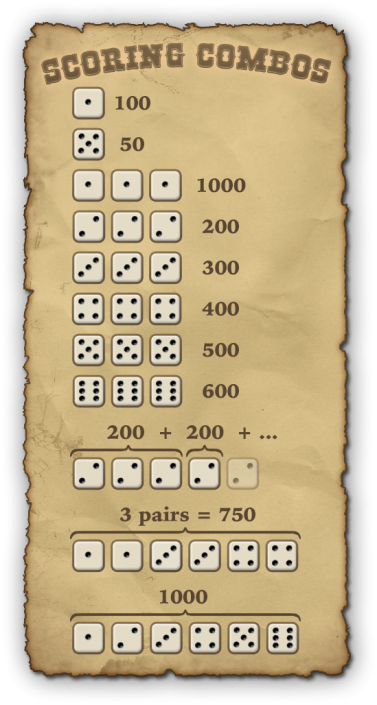

# Drew's zagFarkle Terrible C++ Example

This is a purposefully made bad example of how to implement Farkle as an example for CPSC224 students at Gonzaga.

---

Official rules for 224's Farkle project: http://farkle.games/official-rules/

### Contributors:

- Drew Bogdan
- Aaron S. Crandall \<crandall@gonzaga.edu>

### License:

[Creative Commons Attribution-NonCommercial-NoDerivatives 4.0 International](http://creativecommons.org/licenses/by-nc-nd/4.0/)

